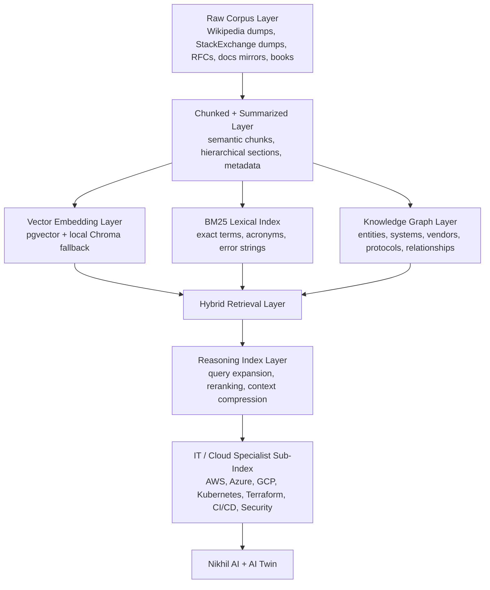

# NikhilVerse Living Library

This is the implementation scaffold for the larger offline-first knowledge system. It does not make the chatbot omniscient yet. It gives the repo a concrete ingestion path, source catalog, hybrid retrieval structure, and update surface to grow toward that.

## Architecture

## Core Sources

- Wikipedia dump index: `https://dumps.wikimedia.org/enwiki/latest/`
- Project Gutenberg RDF feed: `https://www.gutenberg.org/cache/epub/feeds/rdf-files.tar.bz2`
- StackExchange dump archive: `https://archive.org/details/stackexchange`
- arXiv bulk data help: `https://info.arxiv.org/help/bulk_data.html`
- PubMed Central OA FTP: `https://ftp.ncbi.nlm.nih.gov/pub/pmc/`
- RFC bulk retrieval: `https://www.rfc-editor.org/retrieve/bulk/`
- W3C technical reports: `https://www.w3.org/TR/`
- AWS docs: `https://docs.aws.amazon.com/`
- Azure docs: `https://learn.microsoft.com/azure/`
- GCP docs: `https://cloud.google.com/docs`
- Kubernetes docs: `https://kubernetes.io/docs/home/`

## Practical Phases

1. Start with the legal high-value core: official cloud docs, Kubernetes docs, RFCs, Stack Overflow cloud tags, Wikipedia, and curated open textbooks.
2. Chunk and deduplicate locally first. Persist metadata and embeddings only after quality filtering.
3. Keep personal AI Twin memory physically separate from the global library.
4. Run nightly delta ingestion through GitHub Actions for metadata refresh and local cron for large offline mirrors.
5. Add graph edges only for normalized entities that are useful for traversal.

## Important Constraint

You cannot honestly claim this system already exceeds every frontier model. What this scaffold does is create the path to a much stronger, better-grounded NikhilVerse knowledge core without depending on paid APIs.
